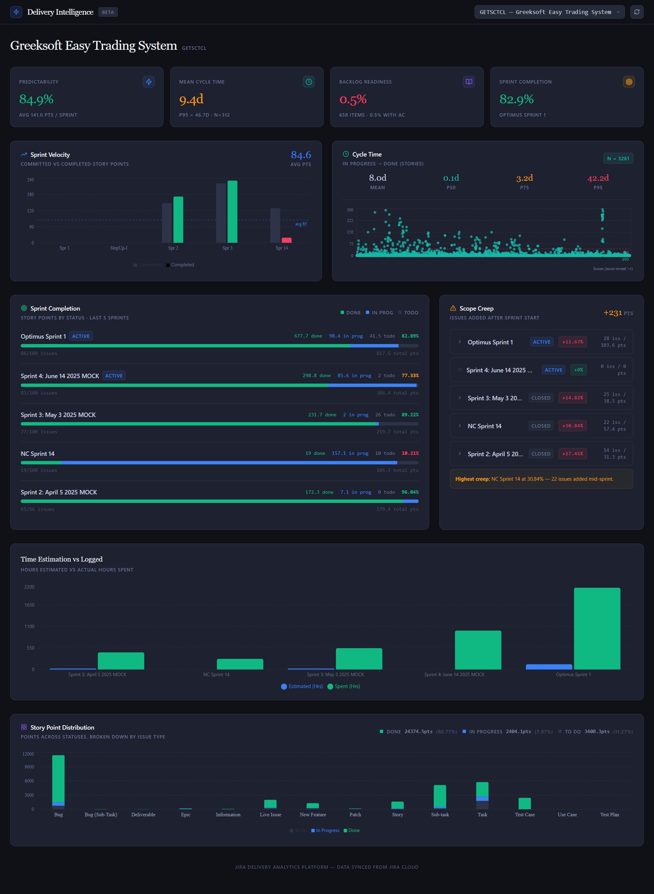

Jira Delivery Intelligence 🚀

An enterprise-grade analytics engine and dashboard designed to transform raw Jira data into actionable delivery insights. This project handles large-scale datasets (10,000+ issues) using a containerized ELT (Extract, Load, Transform) architecture.

--------------------------------------

--------------------------------------

🌟 Key Features

1. Automated Data Pipeline: Extracts data from Jira Cloud APIs and loads it into a local PostgreSQL warehouse.
2. Smart Story Point Engine: Automatically calculates story points based on time-spent and original estimates for historical tickets without manual entry.
3. Self-Healing Architecture: Docker-based setup with an intelligent frontend "Retry Loop" that manages user expectations during heavy data syncs.
4. Enterprise Metrics:
	Sprint Velocity: Committed vs. Completed story points.
	Mean Cycle Time: Analyzes the P95 lead time for delivery.
	Scope Creep Tracking: Monitors issues added after the sprint start.
	Backlog Readiness: Measures "Definition of Ready" (DoR) compliance across the backlog.

---------------------------------------------

🏗️ Technical Architecture

Frontend: React 18, Tailwind CSS, Recharts (for data visualization), Lucide Icons.

Backend: FastAPI (Python 3.11), SQLAlchemy ORM.

Database: PostgreSQL 15.

Infrastructure: Docker & Docker Compose for full environment orchestration.

--------------------------------

🚀 Getting Started

Prerequisites
1. Docker Desktop
2. Jira Cloud Account (with API Token)

Installation Process

1. Clone the repository:

In Bash

git clone https://github.com/niku-tndn15/jira-delivery-intelligence.git 

cd jira-delivery-intelligence

2. Configure Environment Variables:
Create a .env file in the root directory:

Code snippet

JIRA_URL=https://your-domain.atlassian.net

JIRA_EMAIL=your-email@example.com

JIRA_API_TOKEN=your_token_here

3. Spin up the containers:

In Bash

docker-compose up -d --build

4. Access the Dashboard:
   
Open http://localhost:3000. The system will automatically begin the initial data pull from Jira.

--------------------------------------------

🛠️ Performance & Scaling
This project is optimized for large Jira instances. During the initial sync of 11,000+ issues, the system employs a background worker to prevent API timeouts. The UI includes a dynamic "Data Warehouse Building" state with an automated countdown and refresh logic to ensure a smooth user experience during high-volume data ingestion.

----------------------------------------------

How to use this:
1. Create a new file in your root jira-analytics folder named README.md.
2. Paste the content above into it and save.
3. Go to your GitHub tab and follow the "push an existing repository" commands:

In Bash

git init

git add .

git commit -m "Initial commit: Professional Jira Intelligence Platform"

git branch -M main

git remote add origin https://github.com/niku-tndn15/jira-delivery-intelligence.git

git push -u origin main

-----------------------------------------
